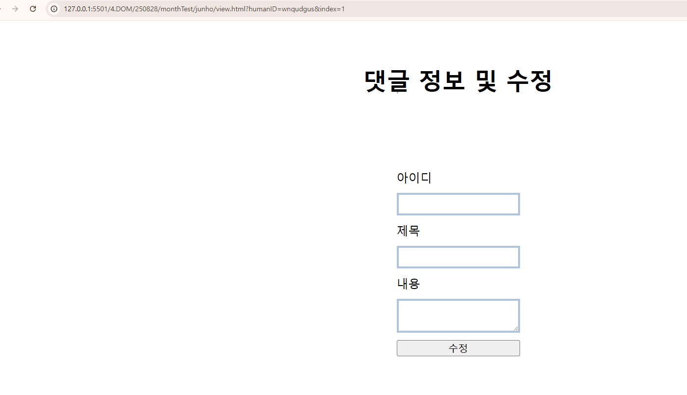

# 준호님 피드백

82점

### | 1  | 제목, 내용, 작성자 입력 후 댓글을 작성하면 화면에 바로 보이는가? (작성 날짜도 함께 출력) | 10 |

10점

### | 2  | 브라우저를 새로 열어도 이전에 작성한 댓글이 유지되는가?           | 10 |

10점

### | 3  | 모든 댓글이 목록 형태로 잘 정리되어 출력되는가?                           | 10 |

10점

### | 4  | 댓글 제목을 클릭하면, 해당 댓글의 상세/수정 페이지로 잘 이동되는가?               | 6 |



```js
const humanID = Number(params.get("humanID"));
```

해당 유저 아이디 값은 기본적으로 문자열이기 때문에
Number로 치환할 필요가 없을 뿐더러 NaN(Not a Number)이기 때문에

```js
if (comment && comment.humanID === humanID) {
    humanidInput.value = comment.humanID;
    titleInput.value = comment.title;
    detailTextarea.value = comment.detail;
}
```

이게 작동이 안됌

1. 브라우저 창 두 개를 띄움
2. 다른 브라우저 창에서 기존 목록의 글 하나를 삭제함
3. 또 다른 브라우저 창에서는, 당연히, 삭제가 되지 않음.
4. 해당 글을 클릭해서 상세 페이지로 가보면 들어가짐
=> 들어가지면 안됌

### | 5  | 댓글을 수정한 후 저장하면, 수정된 내용이 목록에 잘 반영되는가?                  | 8 |

10점

### | 6  | ❌ 버튼을 누르면 해당 댓글이 삭제되고, 새로고침해도 삭제된 상태가 유지되는가?          | 10 |

10점

### | 7  | 각 기능별로 HTML, JS, CSS 파일이 명확히 나뉘어 있는가?                 | 10 |

```css
* {
    padding: 0;
    margin: 0;
}
```

위의 코드가 모든 css파일에 적용되어 있음.
차라리, reset.css를 만들어서 공통으로 적용되었으면 좋았을텐데

### | 8  | 코드가 간결하고, 같은 기능이 반복되지 않도록 잘 정리되어 있는가?                 | 4 |

하나 질문: 내가 수업할 때 작성되었던 코드가 너무 많이 보인다.
참고를 좀 많이 한 듯.

준호: 

원래는 안보고 쳤었음.
그렇다가, 적용이 되지 않는 부분, 에러가 나는 부분이 있어서....
안보고 치는게 목표였는데...막히는 부분에 들어가면 어쩔 수 없음

취지가 있거든.

### | 9  | CSS를 통해 정렬, 여백, 폰트 등이 적용되어 보기 좋은 화면을 구성했는가?           | 4 |

페이지가 총 두 개가 있음

- 목록
- 상세이자 수정

헤드라인 같은 경우는 일관성이 있지만
그 외에는 통일성, 정렬, 정갈하다고 생각되지는 않음.

교강사 생각: 아무래도, CRUD를 안보고 쳐보겠다라는 목표가 확고했고, 거기에만 몰두한 것 같음.  
그러다보니, 입력할 수 있는 형태나 볼 수 있는 형태는 유지한 것 같음.

목록 페이지 버튼도 좀 꾸몄으면 좋았을 걸 ㅠ
준호: 그 전에 완전히 다 꾸몄었는데 색도 입히고....이게 그 때 CSS파일에는 delete가 cursor포인트가
안먹히다가, 싹다 갈아엎어서 ㅠ 시간도 부족하고해서 좀 아쉽습니다.

### | 10 | 코드 흐름이나 개념에 대해 교강사의 질문에 스스로 설명할 수 있는가?                | 10 |

#### 교강사 질문: 원시 타입과 참조 타입의 차이

주소값.

#### 교강사 질문: 함수는 값이야?

값이죠.

#### 참조 타입의 종류 3가지

- 객체
- 배열
- 함수

## 교강사 피드백

이론적인 지식 부분에서는 좋지만

흐름이나 응용 부분에서 좀 어렵다.

기존에 얘기했던.

=> 머릿속에 순서는 아는데! 정리가 안되어있다라는 느낌

뭘 할 줄 알겠어! 근데 뭐부터하지...?

너무 강하게 느껴진다

문법도 약하고.