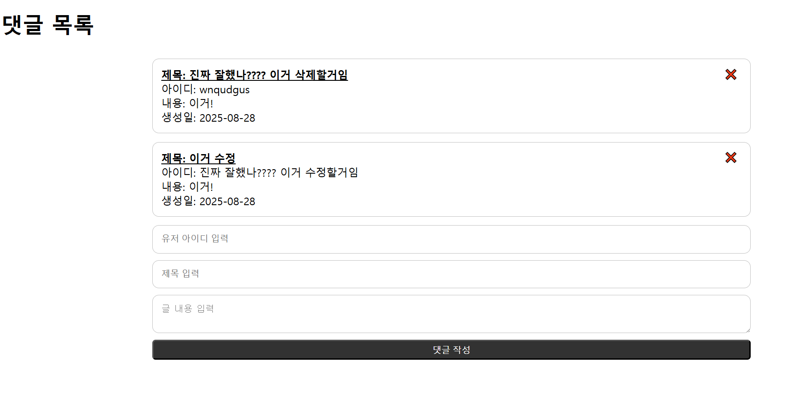
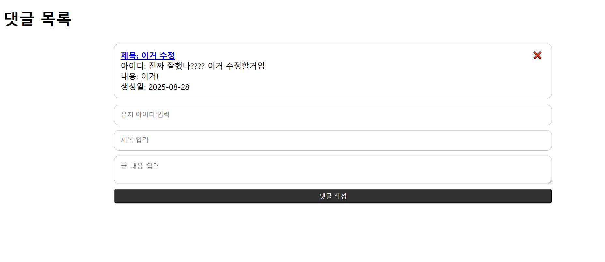
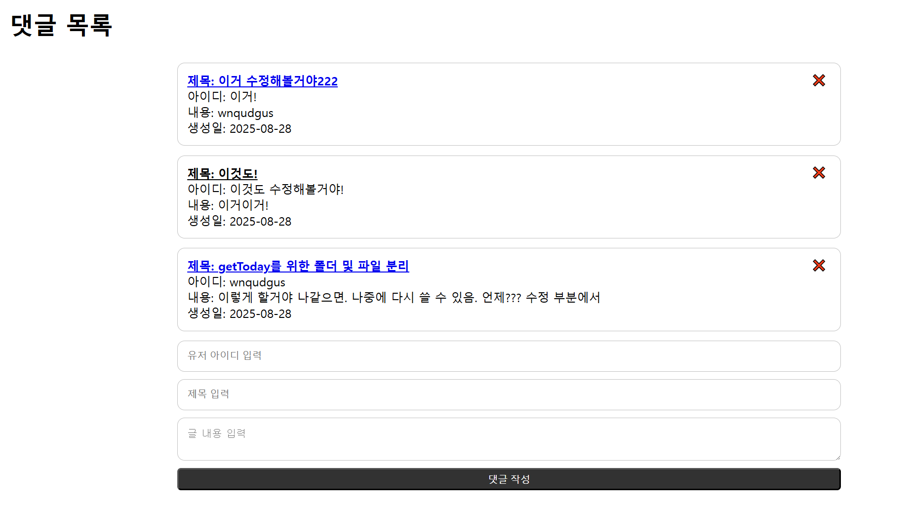
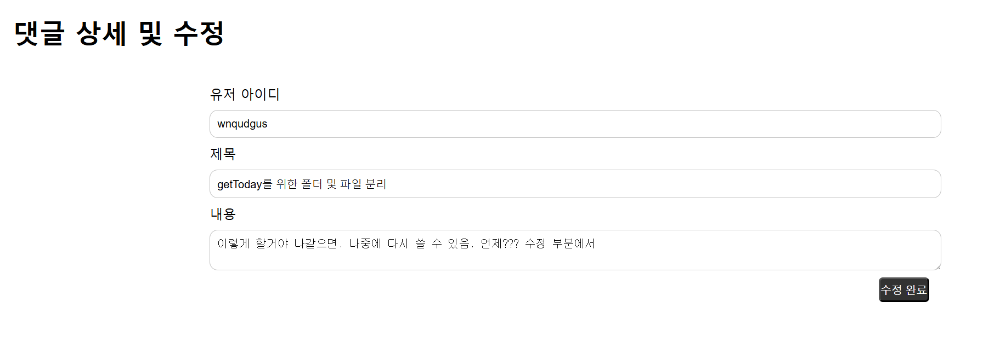

## 요구사항

아래 기능이 실제로 작동하는지 확인하여 평가
**총점: 54점**

재시험

| 번호 | 평가항목                                                                                | 점수 |
| ---- | --------------------------------------------------------------------------------------- | ---- |
| 1    | 제목, 내용 작성자 입력후 댓글을 작성하면 화면에 바로 보이는가? (작성 날짜도 함께 출력 ) | 10   |
| 2    | 브라우저를 새로 열어도 이전에 작성한 댓글이 유지되는가? (localStorage 활용 )            | 10   |
| 3    | 모든 댓글이 목록 형태로 잘 정리되어 출력되는가?                                         | 10   |
| 4    | 댓글 제목을 클릭하면, 해당 댓글의 상세/수정 페이지로 잘 이동되는가?                     | 0    |
| 5    | 댓글을 수정한 후 저장하면, 수정된 내용이 목록에 잘 반영되는가?                          | 0    |
| 6    | ❌버튼을 누르면 해당 댓글이 삭제되고, 새로고침해도 삭제된 상태가 유지되는가?            | 0    |
| 7    | 각 기능별로 HTML, JS, CSS 파일이 명확히 나뉘어 있는가?                                  | 8    |
| 8    | 코드가 간결하고, 같은 기능이 반복되지 않도록 잘 정리되어 있는가?                        | 6    |
| 9    | CSS를 통해 정렬, 여백, 폰트 등이 적용되어 보기 좋은 화면을 구성했는가?                  | 4    |
| 10   | 코드 흐름이나 개념에 대해 교강사의 질문에 스스로 설명할 수 있는가?                      | 6   |

## 교강사 피드백

### 상세 페이지 부분

1. 글을 최초로 작성한다.
2. 글을 두 번째로 작성한다.
3. 그리고 상세 페이지에 접속한다.


구현이 되어있지 않다.

### 삭제 부분

1. 글을 최초로 작성한다.
2. 글을 두 번째로 작성한다.
3. 두 개의 글의 아이디는 동일한 아이디다.
4. 두 번째 글을 삭제하려고 버튼을 누르고 삭제 처리함
5. 근데 0번째 인덱스가 삭제가 된다.

이는 명백한 오류다

#### 첫 번째 화면(삭제하기전)



#### 두 번째 화면(두 번째 글을 삭제하려고 누르고 난 후)



### 수정 부분

상세 페이지에서 오류가 발생했기 때문에 평가할 수 없다

### 생성 부분 create.js

```js
const comments_create = (e) => {
  e.preventDefault();
  const get_today = () => {
    const today = new Date();
    const year = today.getFullYear();
    const month = String(today.getMonth() + 1).padStart(2, "0");
    const day = String(today.getDate()).padStart(2, "0");
    const date_form = `${year}-${month}-${day}`;
    return date_form;
  };

  const inventory_today = get_today();
  const storage = JSON.parse(localStorage.getItem("storage")) || [];
  const { userid, title, board } = e.target;

  const storage_object = {
    USERID: userid.value,
    TITLE: title.value,
    BOARD: board.value,
    BOARD_DATE: inventory_today,
  };
  storage.push(storage_object);
  localStorage.setItem("storage", JSON.stringify(storage));
  location.reload();
};

comments_form.addEventListener("submit", comments_create);
```

get_today 함수 선언 부분 왜 굳이 함수 안에 함수로 구현함?

교강사는 따로 분리할 것 같음

1. 생성할 때
2. 수정할 때

날짜 구하지 않음?

그러면 함수를 따로 빼겠다.

PUBLIC/utils/getToday.js

```js
const get_today = () => {
  const today = new Date();
  const year = today.getFullYear();
  const month = String(today.getMonth() + 1).padStart(2, "0");
  const day = String(today.getDate()).padStart(2, "0");
  const date_form = `${year}-${month}-${day}`;
  return date_form;
};
```

```html
<!DOCTYPE html>
<html lang="en">
  <head>
    <meta charset="UTF-8" />
    <meta name="viewport" content="width=device-width, initial-scale=1.0" />
    <title>댓글 목록 페이지</title>
    <link rel="stylesheet" href="../PUBLIC/CSS/reset.css" />
    <link rel="stylesheet" href="../PUBLIC/CSS/list.css" />
  </head>

  <body>
    <div id="comments">
      <h1>댓글 목록</h1>
      <ul class="comments-list"></ul>
      <form class="comments-form" action="./view.html" method="get">
        <input type="text" name="userid" placeholder="유저 아이디 입력" />
        <input type="text" name="title" placeholder="제목 입력" />
        <textarea name="board" placeholder="글 내용 입력"></textarea>
        <button type="submit">댓글 작성</button>
      </form>
    </div>
    <script src="../PUBLIC/utils/getToday.js"></script>
    <script src="../PUBLIC/JS/read.js"></script>
    <script src="../PUBLIC/JS/create.js"></script>
    <script src="../PUBLIC/JS/delete.js"></script>
  </body>
</html>
```

그리고? 화면을 보니까?



### 오류가 왜 발생하는 줄 알아?

일부러 수업 때 예외 처리를 엉성하게 함.

월별 평가의 의미: 최대한 참고하지 않고 본인의 힘으로 책임지는 것

근데? 여기서 에러가 났다? => 내 코드를 많이 참고했다.

더더욱이 준상님 같은 경우는 전공자이며 경력자인데....

### CSS를 통해 정렬, 여백, 폰트 등이 적용되어 보기 좋은 화면을 구성했는가?|8|

일관되어 있지 않음.

댓글 목록에서는 일관되어 있으나....

상세 및 수정 페이지로 가본다면?

폰트가 일정하지 않음

#### 목록 페이지


#### 상세 페이지



버튼의 여백 크기도 일정하지 않음
목록과 상세 페이지의 textArea는 왜 폰트가 따로 노는건데?

하지만, 위의 제목을 나타내는 nav 텍스트는 일정되어 있음
마음에 듬.

이건 내 시연을 참고해서 많이 구현하려고 한 것 같음.

그리고 버튼의 위치도. 이건 정말 잘했음
=> 내 영상을 많이 참고한 티가 많이 남.

### 교강사 질문: delete.js에 대해서 평가와 실행 말해보세요

1. 평가 단계에서 comment_delete함수 평가하구요
2. 실행 단계에서 이벤트를 실행해서, comment_delete 함수 실행할 것 같다.

#### 교강사 질문: delete.js에서 실행 컨텍스트가 몇 개?

준상님 대답: 대략 11개

내 의도는 큰 틀에서의 실행 컨텍스트를 말했지만
준상님 말도 맞음