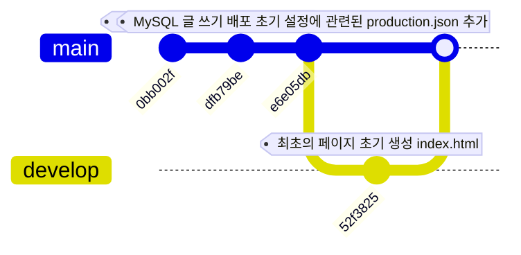

# 지금까지의 Git

```sh
add => commit => log
```

```sh
워킹디렉토리 => 스테이징에어리어 => 로컬_레포지토리
```

<!-- 여긴 교강사만! -->



그 사이에

reset
revert

여까지는 로컬이여

중점적으로 결국 기준
=> `.git`

외부 저장소로 보내야한다.
또는 원격 저장소
=> **밖에 있는 또 하나의 .git**

그걸 내려(pull)받고....병합하고....다시 보내(push)고....

그걸 가능하게 해주는 플랫폼이 `github`

소주 한 잔함

2008년 개발자 Chris Wastrath, PJ Hyett 등등
Github를 개발함
=> 소셜 코딩 플랫폼

## git remote add origin

remote: 외부 원격 저장소를 뜻함
add: 원격 저장소 정보를 등록
origin: 원격 저장소 별명임!!(마음대로 지어도 상관은 없음.)
